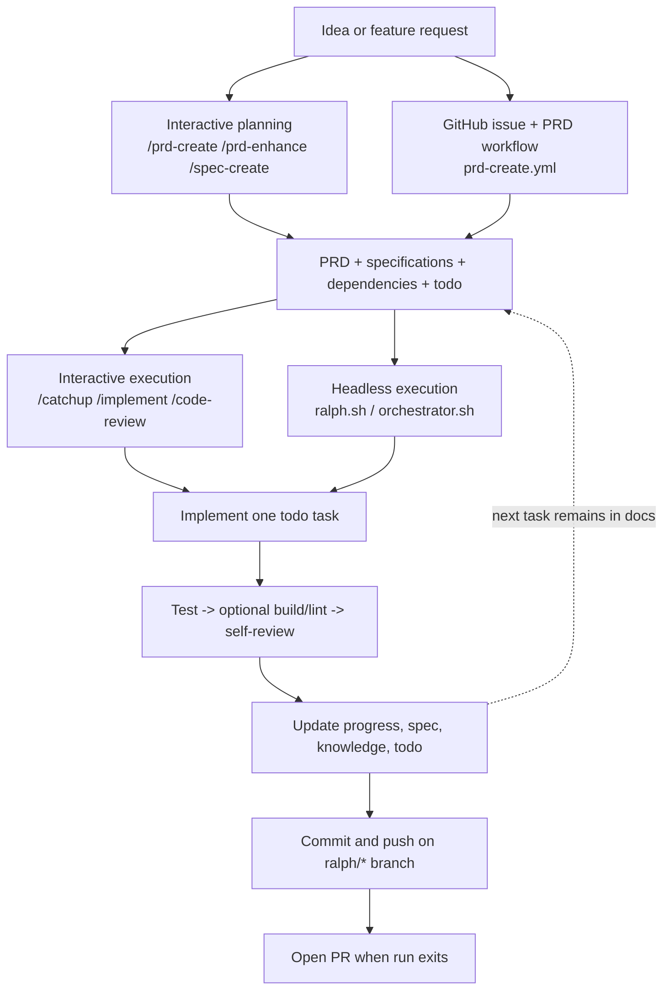

# Ralph Matsuo

Docs-first workflow template for [Claude Code](https://docs.anthropic.com/en/docs/claude-code).

Ralph Matsuo gives Claude Code a stable execution contract built from Markdown documents instead of ad-hoc prompts. PRDs, specifications, dependencies, progress tracking, and todo lists become the shared control plane for:

- interactive execution with Claude Code skills
- headless execution with Ralph Loop
- GitHub Actions automation for PRD intake and implementation runs

If you want coding agents to work from explicit plans, take one task at a time, and keep planning artifacts updated as implementation moves, this repository is the template.

## What Ralph Is

Ralph Matsuo is:

- a reusable repository template for PRD-driven development
- a set of Claude Code skills, Bash scripts, and GitHub Actions workflows
- a document contract centered on `docs/prds/prd-{slug}/`

## What Ralph Is Not

Ralph Matsuo is not:

- a standalone product runtime
- an unconstrained general-purpose agent shell
- a zero-config drop-in for every repository

## Why Ralph

- **Documents stay authoritative**: `prd.md`, specifications, dependencies, progress, and `todo.md` drive execution.
- **Interactive and autonomous modes share the same artifacts**: planning and execution do not fork into separate systems.
- **Execution is constrained**: each iteration handles one todo task, then tests, validation, and self-review.
- **Branch and PR flow are built in**: PRD-defined branches can be pushed each iteration and turned into pull requests automatically at the end of a run.
- **The template stays reusable**: adopters customize the workflow around their own stack instead of inheriting a demo app.

## How Ralph Works

Planning produces documents. Agents execute from those documents.



The orchestrator runs at most one ready PRD per invocation. If multiple PRDs are ready, it picks the first ready `docs/prds/prd-*` directory in shell sort order, executes that PRD, and exits. A later scheduled or manual run re-evaluates the remaining PRDs from the repository default branch state.

## Quick Start

### 1. Evaluate the template locally

You can inspect the execution flow without creating a sample app or installing package dependencies:

```bash
./scripts/ralph/orchestrator.sh --dry-run
```

What this tells you:

- `./scripts/ralph/orchestrator.sh --dry-run` shows how Ralph scans `docs/prds/` and decides whether work is actionable

Then inspect:

- [`docs/prds/_template/prd.md`](./docs/prds/_template/prd.md)
- [`docs/prds/_template/todo.md`](./docs/prds/_template/todo.md)
- [`docs/prds/_template/specifications/spec-001-example.md`](./docs/prds/_template/specifications/spec-001-example.md)

### 2. Adopt Ralph in your repository

Use this repository as a template, or copy these units into an existing repository:

- `CLAUDE.md`
- `ralph.toml`
- `.claude/`
- `scripts/ralph/`
- `docs/prds/_template/`

If you want the bundled GitHub automation, copy `.github/` wholesale instead of cherry-picking individual workflows and scripts.

### 3. Describe your project

Recommended:

```text
claude
> /setup-ralph-matsuo
```

That setup pass should fill or refine:

- fill in [`CLAUDE.md`](./CLAUDE.md)
- define command roles in [`ralph.toml`](./ralph.toml)
- ask for the default conversation language first and save it in `.claude/rules/language.md`
- refine conventions in `.claude/rules/*.md`
- document your stack in [`docs/architecture.md`](./docs/architecture.md)
- replace the template direction in [`docs/roadmap.md`](./docs/roadmap.md)

If you only want to tune the command registry, run `/ralph-registry-setup`.

### 4. Create the first PRD

Interactive path:

```text
claude
> /prd-create my-feature
> /spec-create my-feature authentication
```

GitHub path:

1. open an issue from `.github/ISSUE_TEMPLATE/prd-create.yml`
2. apply the `ralph:prd-requested` label
3. let `prd-create.yml` generate `docs/prds/prd-{slug}/...` as a pull request against the default branch

### 5. Execute work

Interactive execution:

```text
claude
> /catchup
> /implement
> /commit-push
```

Autonomous execution:

```bash
./scripts/ralph/ralph.sh --tool claude --prd docs/prds/prd-my-feature 10
```

Or let the orchestrator choose the next ready PRD:

```bash
./scripts/ralph/orchestrator.sh --max-iterations 10
```

If the branch named in a PRD's `## Branch` section does not exist yet, Ralph creates it from the current HEAD on first execution. Each successful Ralph iteration is expected to leave the branch committed and pushed; the GitHub workflow only handles the final PR creation step.

## Requirements and Automation

### Core tools

- required for the core workflow: `bash`, `git`, `claude`
- required for included Claude hook behavior: `jq`
- required for this template's local validation and bundled GitHub installer path: `npm`
- optional but used by several automated GitHub steps: `gh`

### Runner options

During `/setup-ralph-matsuo`, you choose how GitHub Actions runners are provisioned:

| Option | Runner | Claude Auth | Secret Required |
|--------|--------|-------------|-----------------|
| Self-hosted EC2 | `[self-hosted, linux, ec2, claude, ralph]` | OAuth (Claude Max/Pro) | None |
| GitHub-hosted | `ubuntu-latest` | API Key | `ANTHROPIC_API_KEY` |

The EC2 option uses AWS CDK (`infra/`) to provision an Ubuntu instance with Session Manager access. After deployment, you connect via SSM to complete Claude OAuth login and GitHub Actions runner registration. See `infra/` for details.

To destroy the EC2 instance: `cd infra && bash scripts/destroy.sh`

### GitHub permissions and secrets

If you plan to use the bundled GitHub automation, configure the repository in `Settings -> Actions -> General -> Workflow permissions`:

1. Select `Read and write permissions`
2. Enable `Allow GitHub Actions to create and approve pull requests`

Also make sure:

- `ANTHROPIC_API_KEY` is configured for Claude Code CLI automation (not needed with OAuth on self-hosted runners)
- the workflow token can use `contents: write`, `issues: write`, and `pull-requests: write`

### Command registry policy

Ralph's canonical command registry is `ralph.toml`.

- `test_primary`
- `test_integration`
- `build_check`
- `lint_check`
- `format_fix`

Those role names are the Ralph contract. The concrete command strings are repository-specific and should point at the existing commands in the adopting repo, whether that is `make`, `just`, `pnpm`, `npm`, `pytest`, `cargo`, or anything else.

This template repository keeps optional roles such as build, lint, and format as `N/A` until an adopting repository replaces them with stack-specific commands.

## Repository Layout

```text
.
├── CLAUDE.md
├── ralph.toml
├── .claude/
│   ├── rules/          # project conventions
│   ├── skills/         # interactive workflows
│   ├── agents/         # specialized forked agents
│   ├── hooks/          # optional guardrails and formatting hooks
│   └── settings.json   # hook wiring
├── scripts/ralph/
│   ├── ralph.sh        # single-PRD autonomous loop
│   ├── orchestrator.sh # multi-PRD selector and runner
│   └── CLAUDE.md       # headless-mode execution instructions
├── infra/              # optional CDK stack for EC2 self-hosted runner
├── docs/
│   ├── architecture.md
│   ├── roadmap.md
│   └── prds/
│       └── _template/  # PRD document templates
└── .github/workflows/
    ├── prd-create.yml
    └── ralph.yml
```

## Included Skills

Ralph ships with 17 skills. They cover the full lifecycle:

- **Planning**: `/catchup`, `/prd-create`, `/prd-enhance`, `/spec-create`, `/req-update`, `/roadmap-update`, `/docs-review`
- **Execution**: `/implement`, `/test`, `/build-check`, `/code-review`, `/commit-push`
- **Support**: `/issue`, `/test-guidelines`, `/drawio`, `/ralph-registry-setup`, `/setup-ralph-matsuo`

The skills are plain `SKILL.md` files under `.claude/skills/`, so you can extend or replace them for your own workflow.

## GitHub Automation

### `prd-create.yml`

Turns a structured issue into a PRD pull request.

- validates that the request has enough information
- generates `docs/prds/prd-{slug}/...`
- opens a PR with the new planning documents

### `ralph.yml`

Runs autonomous execution in GitHub Actions.

- supports manual dispatch for a specific PRD
- supports scheduled scans
- supports push-triggered execution when PRD docs change on the repository's default branch
- processes at most one ready PRD per workflow run, then lets a later run pick the next ready PRD
- keeps project-specific dependency or environment setup in `.github/scripts/setup-project-env.sh`
- can open issues for incomplete PRDs when the workflow token has `issues: write`
- expects Ralph to push each iteration and opens a pull request when appropriate
- does not auto-implement from the temporary `prd-create/*` branch before the PRD PR is merged

## Local Validation

Run the full local validation suite before publishing or opening a pull request:

```bash
npm run validate
```

Useful individual commands:

- `npm test`: shell syntax checks for maintained scripts
- `npm run test:orchestrator`: regression tests for Ralph loop behavior
- `npm run test:repo-lint`: regression tests for repository policy checks
- `npm run lint:repo`: release-readiness checks for repository hygiene and OSS metadata

In this repository, `npm run test:orchestrator` covers both a top-level `--dry-run` smoke check and fixture-based status regression tests for malformed, mismatched, ready, and done PRDs.

## Known Limitations

- The template is Bash and GitHub Actions centric.
- Headless execution assumes Claude Code CLI behavior and output conventions.
- The orchestrator processes at most one ready PRD per invocation.
- Downstream repositories still need to define real build, lint, and format commands when those roles exist in their stack.
- Some automation paths depend on optional tools such as `gh`, even though the core local scripts do not.

## Support and Security

- Usage questions and bug reports: see [`SUPPORT.md`](./SUPPORT.md)
- Contribution expectations: see [`CONTRIBUTING.md`](./CONTRIBUTING.md)
- Security disclosures: see [`SECURITY.md`](./SECURITY.md)
- Community expectations: see [`CODE_OF_CONDUCT.md`](./CODE_OF_CONDUCT.md)

## License

MIT
