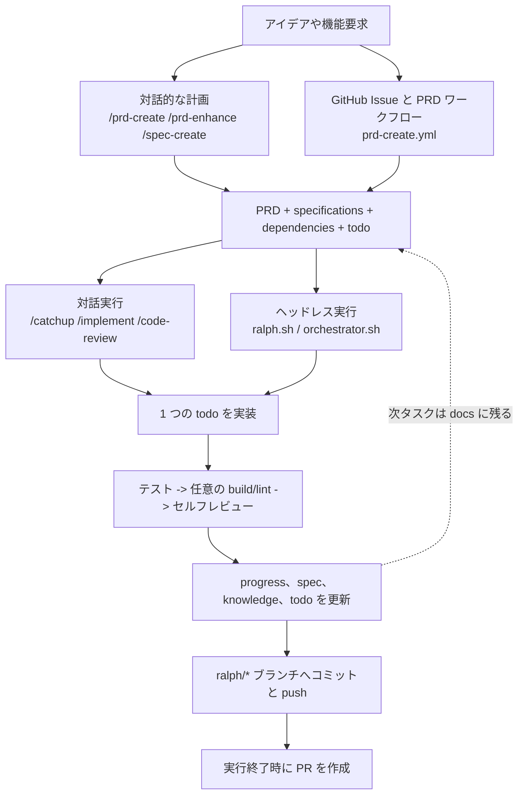

# Ralph Matsuo

`Ralph Matsuo` は [Claude Code](https://docs.anthropic.com/en/docs/claude-code)、Codex、Ralph Loop のための docs-first ワークフローテンプレートです。

名前は Geoffrey Huntley が広めた "Ralph Wiggum" ループへのオマージュで、壊れやすい会話文脈ではなく、リポジトリ上のファイルを実行の基準に据えるという考え方を表しています。PRD、仕様、依存関係、進捗、todo が次の共通コントロールプレーンになります。

- Claude Code スキルによる対話実行
- `.codex/` ガードレールを通した Codex 実行
- Ralph Loop によるヘッドレス実行
- PRD 受付から実装実行までをつなぐ GitHub Actions 自動化

> 対話実行でも自律実行でも、プロンプト履歴ではなくリポジトリ内ドキュメントを実行契約にしたいなら Ralph を選ぶ、というのが一行要約です。

## 30秒でわかる Ralph

- `docs/prds/prd-{slug}/` に計画を書けば、どの実行モードでも同じファイルを読めます。
- 1 ループで 1 タスクだけ進め、毎回テスト、検証、セルフレビューを挟みます。
- Claude Code、Codex、Ralph Loop、GitHub Actions で同じ docs-first 契約を使い回せます。
- デモアプリではなくテンプレートなので、採用側のスタックに合わせて育てられます。

## 現在の公開状態

- このリポジトリが現時点の正規リファレンス実装です。
- このテンプレートを使った公開サンプルリポジトリはまだ公開していません。
- GitHub Releases も未公開なので、厳密に pin したい場合は現状ではコミット SHA を使ってください。

## What Ralph Is

- PRD 駆動開発のための再利用可能なテンプレートリポジトリ
- Claude Code スキル、Codex ガードレール、Bash スクリプト、GitHub Actions の同梱セット
- `docs/prds/prd-{slug}/` を中心にしたドキュメント契約

## What Ralph Is Not

- 単体で完結するプロダクトランタイム
- 制約のない汎用エージェントシェル
- どのリポジトリにもそのまま無調整で刺さるゼロコンフィグ基盤

## なぜ Ralph か

- **一行で言うと**: 計画、対話作業、自律実行をすべてプレーンなリポジトリドキュメントに揃えられます。
- **ドキュメントが正本になる**: `prd.md`、仕様、依存関係、進捗、`todo.md` が実行を駆動します。
- **対話実行と自律実行が分裂しない**: 実行モードごとに別システムを持たず、同じアーティファクトを使います。
- **実行が暴走しにくい**: 1 反復ごとに 1 todo を扱い、そのたびにテスト、検証、セルフレビューを通します。
- **ブランチと PR の流れまで含む**: PRD が定義したブランチに反復ごとの変更を積み上げ、最後に PR 化できます。
- **テンプレートとして再利用しやすい**: 既成のサンプルアプリを剥がすのではなく、自分のスタックに合わせて契約だけ移植できます。

## Ralph の動き方

計画はドキュメントを更新し、エージェントはそのドキュメントを読んで実行します。



オーケストレーターは 1 回の起動で ready な PRD を最大 1 件だけ処理します。ready な PRD が複数ある場合は、`docs/prds/prd-*` をシェルソート順で見て最初の 1 件を実行し、その場で終了します。残りは次回の手動実行やスケジュール実行で再評価されます。

## Quick Start

### 1. まずローカルで流れを見る

サンプルアプリを用意したり依存パッケージを入れたりしなくても、実行フローだけ確認できます。

```bash
./scripts/ralph/orchestrator.sh --dry-run
```

このコマンドでわかること:

- Ralph が `docs/prds/` をどう走査し、何を actionable とみなすか

続けて、次のテンプレートを眺めてください。

- [`docs/prds/_template/prd.md`](./docs/prds/_template/prd.md)
- [`docs/prds/_template/todo.md`](./docs/prds/_template/todo.md)
- [`docs/prds/_template/specifications/spec-001-example.md`](./docs/prds/_template/specifications/spec-001-example.md)

### 2. 自分のリポジトリへ導入する

テンプレートとして使うか、既存リポジトリへ次の単位をコピーしてください。

- `CLAUDE.md`
- `AGENTS.md`
- `ralph.toml`
- `.claude/`
- `.codex/`
- `scripts/ralph/`
- `docs/prds/_template/`

GitHub 自動化も入れたい場合は、個別ファイルをつまみ食いせず `.github/` をまとめて持っていく方が安全です。

### 3. プロジェクト固有情報を埋める

推奨手順:

```text
claude
> /setup-ralph-matsuo
```

このセットアップで埋めるべきもの:

- [`CLAUDE.md`](./CLAUDE.md) のプロジェクト固有ルール
- [`ralph.toml`](./ralph.toml) のコマンドロール
- `.claude/rules/language.md` に保存する既定の会話言語
- `.claude/rules/*.md` のチーム規約
- [`docs/architecture.md`](./docs/architecture.md) の技術スタック説明
- [`docs/roadmap.md`](./docs/roadmap.md) の今後の方向性

コマンドレジストリだけ調整したいなら `/ralph-registry-setup` でも足ります。

### Codex 対応

Codex 向けの設定は `.codex/settings.json` と `.codex/hooks/*` に含まれており、`.claude/` 側のドキュメントガードレールをそのまま反映します。つまり、プロジェクトワークフローを別建てせずに、同じ docs-first 契約を Codex セッションにも持ち込めます。

### 4. 最初の PRD を作る

対話パス:

```text
claude
> /prd-create my-feature
> /spec-create my-feature authentication
```

GitHub パス:

1. `.github/ISSUE_TEMPLATE/prd-create.yml` から Issue を作る
2. `ralph:prd-requested` ラベルを付ける
3. `prd-create.yml` に `docs/prds/prd-{slug}/...` を生成させ、default branch 向けの PR を作る

### 5. 実装を回す

対話実行:

```text
claude
> /catchup
> /implement
> /commit-push
```

自律実行 (Claude):

```bash
./scripts/ralph/ralph.sh --tool claude --prd docs/prds/prd-my-feature 10
```

自律実行 (Codex):

```bash
./scripts/ralph/ralph.sh --tool codex --prd docs/prds/prd-my-feature 10
```

あるいは、次の ready PRD をオーケストレーターに選ばせます。

```bash
./scripts/ralph/orchestrator.sh --tool claude --max-iterations 10
```

PRD の `## Branch` に書かれたブランチがまだ存在しない場合、Ralph は初回実行時に現在の HEAD からそのブランチを作成します。各反復は commit と push まで終えている前提で、GitHub ワークフローは最終的な PR 作成だけを担当します。

## Requirements and Automation

### コアツール

- コアフローに必須: `bash`, `git`, `claude` (または `codex`)
- 同梱の Claude フック動作に必須: `jq`
- このテンプレートのローカル検証に必須: `mise`, `pnpm`
- GitHub インストーラーパスの CLI 導入に必須: `npm`
- 一部の GitHub 自動化で任意利用: `gh`

### ランナー構成

`/setup-ralph-matsuo` では GitHub Actions ランナーの構成方法を選びます。

| 選択肢 | Runner | Claude 認証 | 必要な Secret |
|--------|--------|-------------|----------------|
| Self-hosted EC2 | `[self-hosted, linux, ec2, claude, ralph]` | OAuth (Claude Max/Pro) | なし |
| GitHub-hosted | `ubuntu-latest` | API Key | `ANTHROPIC_API_KEY` |

同梱 workflow は GitHub Actions の repository variable `RALPH_RUNS_ON_JSON` で runner を切り替えます。

- 未設定、または `["self-hosted","linux","ec2","claude","ralph"]` を設定すると self-hosted EC2 モード
- `"ubuntu-latest"` を設定すると GitHub-hosted モード

EC2 ルートでは `infra/` の AWS CDK で Ubuntu インスタンスを作成し、Session Manager で入って Claude OAuth と GitHub Actions runner 登録を行います。詳細は `infra/` を見てください。

EC2 を破棄するコマンド:

```bash
cd infra && bash scripts/destroy.sh
```

### GitHub 権限と Secret

同梱の GitHub 自動化を使う場合、`Settings -> Actions -> General -> Workflow permissions` で次を設定してください。

1. `Read and write permissions` を選ぶ
2. `Allow GitHub Actions to create and approve pull requests` を有効にする

加えて、次も確認してください。

- GitHub-hosted モードでは Claude Code CLI 自動化に使う `ANTHROPIC_API_KEY` が設定されていること（Codex 使用時は `OPENAI_API_KEY`）
- ワークフロートークンに `contents: write`、`issues: write`、`pull-requests: write` があること

### コマンドレジストリ方針

Ralph の正規コマンドレジストリは `ralph.toml` です。

- `test_primary`
- `test_integration`
- `build_check`
- `lint_check`
- `format_fix`

これらのロール名が Ralph の契約です。具体的なコマンド文字列は導入先リポジトリごとに差し替え、`make`、`just`、`pnpm`、`npm`、`pytest`、`cargo` など既存の運用に合わせてください。

このテンプレートでは build、lint、format のような任意ロールは、採用側が実コマンドへ置き換えるまで `N/A` のままにしています。

## リポジトリ構成

```text
.
├── CLAUDE.md
├── ralph.toml
├── .claude/
│   ├── rules/          # プロジェクト規約
│   ├── skills/         # 対話ワークフロー
│   ├── agents/         # 特化型のフォークエージェント
│   ├── hooks/          # 任意のガードレールと整形フック
│   └── settings.json   # フック設定
├── scripts/ralph/
│   ├── ralph.sh        # 単一 PRD の自律ループ
│   ├── orchestrator.sh # 複数 PRD の選択と実行
│   ├── CLAUDE.md       # Claude 用ヘッドレス実行指示
│   └── CODEX.md        # Codex 用ヘッドレス実行指示
├── infra/              # EC2 self-hosted runner 用の任意 CDK スタック
├── docs/
│   ├── architecture.md
│   ├── roadmap.md
│   ├── references/     # セキュリティ監査や調査メモなどの参照資料
│   ├── ubiquitous/     # 用語辞書
│   └── prds/
│       └── _template/  # PRD テンプレート
└── .github/workflows/
    ├── prd-create.yml
    └── ralph.yml
```

## 同梱スキル

Ralph には現在 19 個のスキルが含まれます。主要カテゴリは次の通りです。

- **計画系**: `/catchup`, `/prd-create`, `/prd-enhance`, `/spec-create`, `/req-update`, `/roadmap-update`, `/docs-review`
- **実行系**: `/implement`, `/test`, `/build-check`, `/code-review`, `/commit-push`
- **補助系**: `/issue`, `/test-guidelines`, `/drawio`, `/ralph-registry-setup`, `/setup-ralph-matsuo`, `/backport`, `/init-repo`

スキル本体は `.claude/skills/` 配下のプレーンな `SKILL.md` です。必要に応じて自分のワークフロー向けに差し替えたり拡張したりできます。

## GitHub 自動化

### `prd-create.yml`

構造化された Issue を PRD 用 PR に変換します。

- 要求が十分に具体的かを検証する
- `docs/prds/prd-{slug}/...` を生成する
- 計画ドキュメント付きの PR を開く

### `ralph.yml`

GitHub Actions 上で自律実行を回します。

- 特定 PRD を指定した手動起動に対応（AI ツールとして `claude` または `codex` を選択可能）
- 現在の同梱状態では `workflow_dispatch` の手動起動を有効化
- `schedule` と `push` のトリガーは必要に応じて導入先で追加または再有効化
- 1 回の workflow run で ready PRD を最大 1 件だけ処理
- プロジェクト固有の依存セットアップを `.github/scripts/setup-project-env.sh` に閉じ込める
- token に `issues: write` があれば未完成 PRD の Issue を起票できる
- Ralph 側が反復ごとに push する前提で、必要に応じて PR を作る
- 一時的な `prd-create/*` ブランチ上で、PRD PR 未マージのまま自動実装はしない

## Local Validation

公開や PR 作成の前に、ローカル検証を一通り流してください。

```bash
mise trust .mise.toml
mise install
pnpm run validate
```

個別によく使うコマンド:

- `pnpm test`: 維持対象シェルスクリプトの構文チェック
- `pnpm run test:orchestrator`: Ralph loop の回帰テスト
- `pnpm run test:repo-lint`: リポジトリポリシーの回帰テスト
- `pnpm run lint:repo`: リポジトリ衛生と OSS メタデータの検査

このリポジトリの `pnpm run test:orchestrator` には、トップレベルの `--dry-run` スモークテストに加えて、不正 PRD、branch 不整合、ready、done などの fixture ベース回帰テストが含まれています。

## Known Limitations

- テンプレートは Bash と GitHub Actions を中心に組まれています。
- オーケストレーションのコアはまだ shell-first で、Windows 移植性や細かなユニットテスト性では Python/TypeScript コアに劣ります。
- ヘッドレス実行は Claude Code CLI または Codex CLI の挙動と出力規約を前提にしています。
- オーケストレーターは 1 回の起動で ready PRD を最大 1 件しか処理しません。
- 導入先リポジトリでは build、lint、format の実コマンドを別途定義する必要があります。
- 一部の自動化パスは、コアローカルスクリプトが不要でも `gh` のような任意ツールに依存します。

ファイル契約そのものは安定化させる前提ですが、オーケストレーション実装をどの言語へ寄せるかは、テンプレートの表面積が固まった後も改善余地として残しています。

## Support and Security

- 使い方の質問やバグ報告: [`SUPPORT.md`](./SUPPORT.md)
- コントリビューション方針: [`CONTRIBUTING.md`](./CONTRIBUTING.md)
- セキュリティ開示: [`SECURITY.md`](./SECURITY.md)
- コミュニティ行動規範: [`CODE_OF_CONDUCT.md`](./CODE_OF_CONDUCT.md)

## ライセンス

MIT
